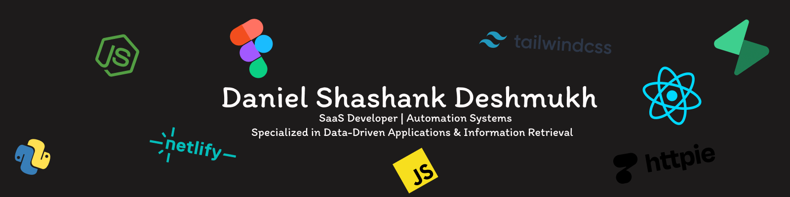

  

 

<h1 align="left">Hi, I'm Daniel Deshmukh </h1>

  <strong>Full-Stack Software Architect | SaaS Developer | AI Implementation Specialist</strong>

  

---

###  Currently Building
- **[HECTOR](https://github.com/DanielDeshmukh/Hector)**: Legal decision engine & document retrieval optimized for BNS 2023.
- **[AETHER](https://github.com/DanielDeshmukh/aether)**: Autonomous security audits using Agentic Reasoning Loops.
- **[Ella](https://github.com/DanielDeshmukh/ella)**: Medical clinical receptionist utilizing Hard-RAG protocols.

---

###  Expertise & Learning
-  **Deep Dive:** Advanced RAG Architectures, Fine-tuning LLMs, and Vector Space Models.
-  **Fun Fact:** I think I'm funny (my code usually agrees).
-  **Portfolio:** [danieldeshmukh.netlify.app](https://danieldeshmukh.netlify.app/)
-  **Reach Me:** [deshmukhdaniel2005@gmail.com](mailto:deshmukhdaniel2005@gmail.com)

---

###  Technical Ecosystem

**Languages & Frontend**

  

**Backend, AI & Database**

  

**DevOps & Design Tools**

  

---

###  GitHub Metrics

  

  <!-- Today's Commits & Continuous Streak -->
  

  <!-- Total Commits (Including Jan 1st - Today) & Language Stats -->
  <!-- 
   -->

---

### Connect With Me

  

