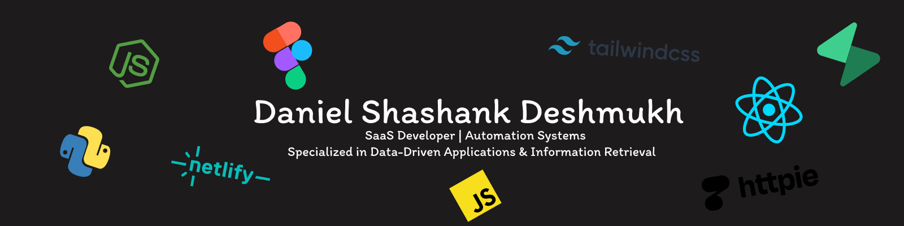

  

 

  
  &nbsp;
  
  &nbsp;
  

 

<h1 align="center">
  Daniel Deshmukh
</h1>

  <strong>I build systems that reason — autonomous agents, RAG pipelines, and production AI.</strong> 
  Mumbai · CS Graduate, Mumbai University

  <b>Currently:</b> THEMIS v5 — retrieval-grounded legal LLM on Indian statutory law · 52,170 training examples · Targeting AI Engineer roles in Germany & Abu Dhabi

 

  
  &nbsp;
  
  &nbsp;
  
  &nbsp;
  

 

---

## Pinned Repos

<table>
  <tr>
    <td width="33%" valign="top">
      <h4><a href="https://github.com/DanielDeshmukh/autobots">autobot-swarm</a></h4>
      
<i>Multi-agent CLI for NVIDIA NIM orchestration</i>

      
      
      
      
    </td>
    <td width="33%" valign="top">
      <h4><a href="https://github.com/DanielDeshmukh/themis">THEMIS</a></h4>
      
<i>Parametric legal LLM for Indian law — v5 retrieval-grounded</i>

      
      
      
      
    </td>
    <td width="33%" valign="top">
      <h4><a href="https://github.com/DanielDeshmukh/aether">AETHER</a></h4>
      
<i>Autonomous pentest with agentic reasoning</i>

      
      
      
    </td>
  </tr>
  <tr>
    <td width="33%" valign="top">
      <h4><a href="https://github.com/DanielDeshmukh/Hector">HECTOR</a></h4>
      
<i>Zero-hallucination legal RAG for Indian law</i>

      
      
      
      
    </td>
    <td width="33%" valign="top">
      <h4><a href="https://github.com/DanielDeshmukh/ella">Ella</a></h4>
      
<i>Medical triage RAG with hallucination guardrails</i>

      
      
      
      
    </td>
    <td width="33%" valign="top">
      <h4><a href="https://github.com/DanielDeshmukh/proteus">PROTEUS</a></h4>
      
<i>5-agent JD-aware resume analyzer</i>

      
      
      
      
    </td>
  </tr>
  <tr>
    <td width="33%" valign="top">
      <h4><a href="https://github.com/DanielDeshmukh/CodeSage">CodeSage</a></h4>
      
<i>AI codebase examiner for interviews</i>

      
      
      
      
    </td>
    <td width="33%" valign="top">
      <h4><a href="https://github.com/DanielDeshmukh/github-profile-score">github-profile-score</a></h4>
      
<i>Embeddable GitHub profile scorer</i>

      
      
      
    </td>
    <td width="33%" valign="top">
      <h4><a href="https://github.com/DanielDeshmukh/TradeX">TradeX</a></h4>
      
<i>AI-powered trading platform for beginners</i>

      
      
      
    </td>
  </tr>
</table>

---

## Packages

| Package | Description | Install | Stats |
|---------|-------------|---------|-------|
| [**autobot-swarm**](https://pypi.org/project/autobot-swarm/) | Hierarchical multi-cluster coding swarm CLI | `pip install autobot-swarm` |   |
| [**ella-sdk**](https://pypi.org/project/ella-sdk/) | Medical Triage & Clinical RAG Engine | `pip install ella-sdk` |   |
| [**themis-llm**](https://pypi.org/project/themis-llm/) | Retrieval-grounded LLM for Indian statutory law | `pip install themis-llm` |   |
| [**themis-mcp**](https://pypi.org/project/themis-mcp/) | MCP server for THEMIS — law Q&A via local LLM | `pip install themis-mcp` |   |

---

| Package | Description | Install | Stats |
|---------|-------------|---------|-------|
| [**proteus-mcp**](https://www.npmjs.com/package/proteus-mcp) | MCP server for JD-aware resume matching pipeline | `npm install -g proteus-mcp` |   |

---

## Stack
 
<table>
  <tr>
    <td align="center" width="140"><b>AI & Agents</b></td>
    <td>
      
      
      
      
      
    </td>
  </tr>
  <tr>
    <td align="center"><b>Backend</b></td>
    <td>
      
      
      
      
    </td>
  </tr>
  <tr>
    <td align="center"><b>Frontend</b></td>
    <td>
      
      
      
      
    </td>
  </tr>
  <tr>
    <td align="center"><b>Data & Storage</b></td>
    <td>
      
      
      
      
    </td>
  </tr>
  <tr>
    <td align="center"><b>DevOps</b></td>
    <td>
      
      
      
      
    </td>
  </tr>
</table>
 

---

## Focus Areas

  
  &nbsp;
  
  &nbsp;
  
  &nbsp;
  
  &nbsp;
  

---

## Client Projects

| Client | Projects | Description |
|--------|----------|-------------|
| **Babuji Chaay** | [Website](https://github.com/DanielDeshmukh/BabujiChaay-website) · [POS System](https://github.com/DanielDeshmukh/Babuji-Chaay) | Premium café — website, franchise info, full-stack POS & inventory management |
| **Shree Gurudev Plastics** | [E-commerce](https://github.com/DanielDeshmukh/shree-gurudev-plastics) | B2B wholesale platform — 1361+ products, WhatsApp Business integration |

---

## GitHub Activity

### Profile Score

### Contributions & Streaks

  

  
  

### Insights

  
  
  
  

  
  
  
  

---

## Certifications

**Anthropic Academy**
 

 

**Harvard**
 

 

**freeCodeCamp**
 

 

**Samsung**
 

 

---

## Connect

  
  &nbsp;
  
  &nbsp;
  
  &nbsp;
  
  &nbsp;
  
  &nbsp;
  
  &nbsp;
  
  &nbsp;
  
  &nbsp;
  
  &nbsp;
  

